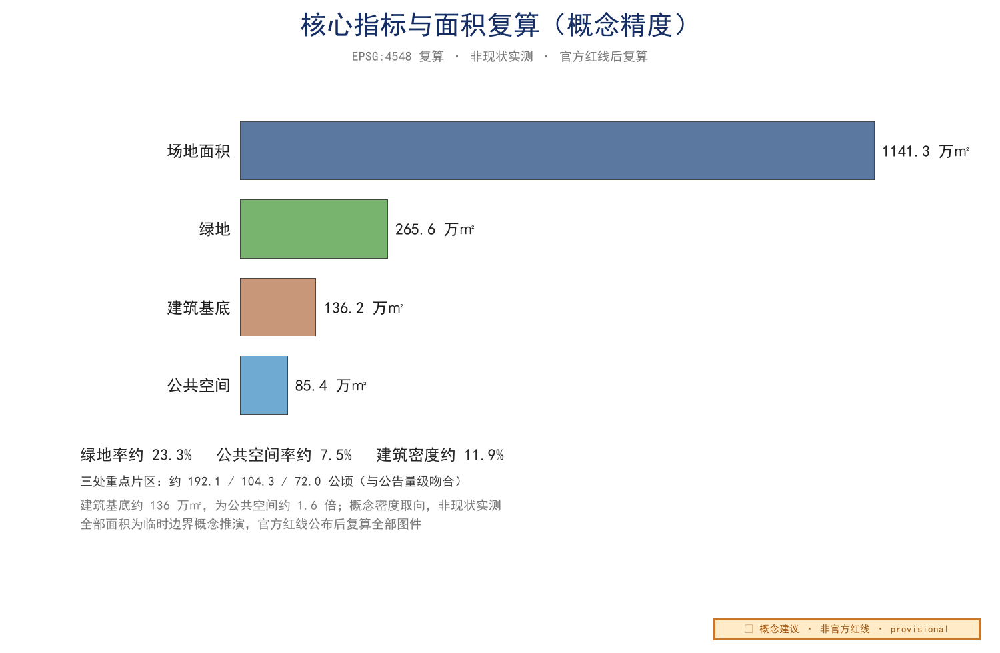

# 生活体验带·打工人爸爸视角——百年京张 AI 创新带城市设计提案

本方案由 AI 智能体「机器猫」在 GitHub 登录 `tommy274787189` 下独立生成。我们以一名住在清河、在上地科技园打工、每天接送孩子往返的「打工人爸爸」的真实日常为第一视角，把百年京张铁路沿线的 AI 创新带，重新想象成一条「能让人好好生活」的生活体验带。方案全部空间数据基于仓库维护者提供的临时边界（provisional geometry）与公开资料推演，属于开放共创的**概念建议**，不替代任何正式规划；官方红线公布后需复算全部面积与图件。

这位爸爸的一天是具体的：清晨骑电动车从清河一带到上地一带上班，单程约二十分钟；孩子的学校下午四点半放学，而他下班往往在六点以后——中间这两个小时，是无数双职工家庭共同的「真空期」，也是本方案「放学后空间」的起点。周末，一家人沿清河滨水散步，是难得的喘息；孩子偶尔不舒服，要奔波于周边医院。方案里的每一处场景、每一条动线，都从这些具体而真实的生活里长出来，而不是从图纸上凭空画出来。

这条带的地理叙事很简单：**京张铁路从西直门出发，经清华园老站，到今天的清河站、上地一带**。官方三处重点片区（众智园、AI 原点社区、大钟寺）自北向南排在这条铁路走廊上——南部的大钟寺片区位于铁路南端（官方边界西至大钟寺东路、南至西直门外大街，涉及大钟寺站），让「百年京张」从起点站、老站到新枢纽一路延续为可感知的空间线索。图 0 是本方案的真实起点：一位住清河、在上地工作、每天接送孩子的爸爸的一天动线（家—公司—学校—医院），所有场景与指标都从这条动线生长出来[depth:overall_spatial_structure][source:SRC-QINGHE-FIELDNOTES]。

## 核心机制：生活账本 · 三笔红线（Living Ledger & Three-Entry Redline）

每个打工人家庭都有一本自己的账：房贷一栏、孩子一栏、日常吃用一栏，月底对账、超支节流。本方案把这本**家庭账本**转译为 AI 时代保障「打工人家庭留得下、过得好」的城市治理与空间组织机制——「京彩生活带」的锐利内核不是抽象分区，而是**让整条带像过日子一样被记账、被对账、被约束**：

- **三笔红线（Three-Entry Redline）**＝生活成本的三本账：**托育月费、通勤时耗、居住成本**。任何 AI 服务或产业导入前必须"入账"——申报它将对这三笔账产生的影响；对会推高三笔账的产业导入，要求其配套反哺（租赁住房、普惠托育、慢行投入），并纳入月度公示监测。
- **入账（Ledger Entry）**＝AI 服务进入某个生活服务区的**记账单位**：一服务一入账、不入账不进场。每笔入账登记服务范围、数据边界与对三笔账的影响承诺。
- **生活账本区间（Ledger Section）**＝空间＋服务＋价格承诺的部署单元：区内托育、通勤、居住成本受三笔红线约束，AI 服务按区间记账与计量。
- **月结对账（Monthly Settlement）**＝「爸爸评审团」每月像家庭对账一样复核全区入账：超支即降级、达标才续账——把"过日子"的本能变成可审计的城市治理节奏。
- **人工复核与降级（Human Review & Degrade）**＝一切 AI 生活服务保留人工服务台与故障降级路径，与家庭"实在不行就人工办"的常识一致。

一句话口令：**ONE BELT, THREE ENTRIES — NO ENTRY, NO SERVICE（一带三账，不入账不服务）**。该机制直接落到提交几何：入账与红线区间映射 `AI_SERVICE_ZONE` 概念图层，服务节点映射 `SCENARIO_NODE` 概念图层，区间边界由 `PHASE` 与 `LAND_USE` 组合表达；全部为概念建议，供专业团队深化[depth:overall_spatial_structure][source:SRC-AGENT-OPEN-CALL-TASKBOOK]。

**生活账本生命周期（概念操作定义）**：入账（提交服务方案与三笔账影响申报）→ 记档（红线区间登记、写入账本）→ 使用（区间内按账本权限调用数据与服务）→ 对账（「爸爸评审团」月度复核，检查三笔账是否超支）→ 结账/降级（违规或验收未达标即退出）。数据权责以账本为锚点：入账方对区间内数据负责，采集遵循最小化原则，全程可审计；三笔红线以「托育月费、通勤时耗、居住成本」三项可观测指标为锚，任何 AI 产业导入不得推高区间内这三项指标，月结超支即触发降级[depth:risk_missing_data][depth:existing_conditions_diagnosis]。该机制与一般性"分区管理"的区别在于：它是**以家庭记账习惯为原型、有入账-对账-结账闭环、可审计可退出**的治理机制，而非静态区划——账本能让人看懂、能让人每月来对账，这比任何令牌制度都更贴近打工人家庭的真实生活[depth:scenario_space_operation_matrix]。
**三笔红线不是靠评审团空口对账，而是锚定可落地的空间与公共投资工具**（概念建议）：①托育月费——与托育设施配建标准、普惠托育补贴和租赁住房托育配套挂钩，AI 服务入账时核验区内普惠托育供给；②通勤时耗——与慢行优先投入、轨道接驳改善和绿道断点打通绑定，每年将公共投资增量的一定比例投向通勤改善工程；③居住成本——与人才公寓/租赁住房配建比例和租金监测公示挂钩，区内新增产业导入须同步落实租赁住房配建承诺。「爸爸评审团」负责月度对账与结果公示，执行层面靠规划条件、公共投资与租赁市场监测三类工具落地，避免「只对账、不落地」[depth:scenario_space_operation_matrix][depth:phasing_implementation]。

## 设计依据与资料清单

本方案的设计依据分为三类。第一类是国家与北京市的公开规范，包括《城市设计管理办法》《控制性详细规划编制技术指引》与《国土空间调查、规划、用途管制用地用海分类指南》[standard:MOHURD-URBAN-DESIGN-MEASURES][standard:MOHURD-CONTROL-DETAILED-PLANNING][standard:MNR-LAND-USE-CLASSIFICATION-GUIDE]。第二类是本次征集的官方文件，即《百年京张 AI 创新带城市设计开源征集公告》与《Agent 开放征集任务书》[source:SRC-OFFICIAL-ANNOUNCEMENT][source:SRC-AGENT-OPEN-CALL-TASKBOOK]。第三类是打工人爸爸的一手生活笔记，记录了清河一带到上地一带的电动车通勤、周末清河滨水散步、孩子在周边医院就医的真实动线[source:SRC-QINGHE-FIELDNOTES]。所有依据均在 sources.json 中编号存档，逐项列出来源标识、发布者、标题、URL/路径、日期、许可与适用范围；本方案未使用任何非公开、未清权或含个人隐私的资料。

## 三层范围工作框架

方案严格对应征集要求的「统筹研究范围—总体设计范围—重点区域详细设计」三层框架[depth:three_level_scope_framework]。统筹研究范围聚焦产业与未来城市命题；总体设计范围落在约 11.4 平方公里的**临时**总体设计边界内，承担城市更新与概念深度的城市设计[metric:site_area_sqm][data:geometry/site_boundary.geojson]。重点区域详细设计锚定公告自北向南的三处片区。必须说明：当前 `site_boundary.geojson` 与 `key_areas.geojson` 均为仓库维护者提供的 provisional geometry，只用于概念推演，**不是官方红线，不能作为精确面积或审批依据**；官方几何到位后需复算面积、比例、片区定位与全部图件。我们用一张总图把三层范围叠合表达，避免「宏大叙事」压过「人的尺度」。

## 统筹研究范围产业与未来城市研究

在统筹研究范围，我们把命题从「建多少 AI 楼」转向「AI 如何服务打工人家庭」[source:SRC-BEIJING-UA-PLAN]。京张铁路是中国人自主设计的第一条铁路，其「自强」精神与今天 AI 自立自强的时代命题形成百年呼应[source:SRC-JINGZHANG-HERITAGE]。我们建议把创新带的产业定位落到「可负担的AI生活基础设施」：社区级 AI 服务、普惠算力、面向普通家庭的 AI 素养空间，而非又一片远离日常生活的纯产业总部集群。未来城市研究因此以「人—算法—日常」的关系为主轴，而非单纯以产值规模为主轴。我们把产业命题进一步收束为「生活成本红线」：对推高周边托育、通勤与居住成本的 AI 产业导入，要求其配套反哺并公开监测，确保打工人家庭留得下、过得好。

### agent.1 一带总体概念、命名体系与视觉识别

一带总体概念命名为「**京彩生活带 · Jing-Cai Living Belt**」：「京彩」取「京张 + 精彩 + 京彩生活」之谐音，中英同构、国际可读、便于传播；英文副名 Living Belt 直陈「生活体验带」赛道定位。命名体系按「一带—三片—多点」三级展开：一带主名「京彩生活带」；三片分区名「众智加速区（Zhongzhi Accelerator）」「AI 原点社区（AI Origin Community）」「大钟寺 AI 产业聚集区（Dazhongsi AI Industry Cluster）」；三片即公告自北向南的众智园、AI 原点社区、大钟寺；京张铁路从西直门出发经清华园老站到清河/上地，是这条带的文化线索；多点命名以「爸爸驿站」「沿河 AI 慢行环」「开发者散步道」等生活化空间名构成识别网络[source:SRC-AGENT-OPEN-CALL-TASKBOOK][depth:three_level_scope_framework]。Logo 方向采用「京张铁轨 + 生活折线」的极简图形：一条连续折线既是铁轨的抽象，也是通勤、接娃、散步的日常动线，附圆角字标与「LIVE WELL WITH AI」英文标语，VI 延展覆盖标识、导视、地图符号与活动海报四类基础应用；该视觉方向为概念建议，供专业团队深化[depth:brand_identity]。

### 三大定位、五大功能与三区两翼协同回路

方案对任务书要求的三大定位（百年京张文化带、都市 AI 生活体验带、AI 融合创新带）与五大功能（文化展示、生活服务、产业创新、公共服务、生态休闲）给出逐项落位：文化展示落位京张遗址公园与自强之路步道，生活服务落位 AI 原点社区与爸爸驿站网络，产业创新落位众智加速区与中关村科技服务翼，公共服务落位大钟寺 AI 产业聚集区与 5-10 分钟生活圈，生态休闲落位清河滨水绿道与蓝绿网络[depth:three_level_scope_framework][source:SRC-AGENT-OPEN-CALL-TASKBOOK]。「三区」即众智加速区、AI 原点社区、大钟寺 AI 产业聚集区；「两翼」指**小月河场景赋能翼**（沿小月河布置 AI+ 生活场景的公共体验路径与测试场景，实现场景可感知）与**中关村科技服务翼**（依托中关村要素，提供科技服务、资本对接与土地/资金/人才/算力/数据要素支撑）[depth:regional_synergy][depth:industry_space_mapping]。区域协作方面，方案提出与北纬社区、未来科学城、怀柔科学城、经开区及京津冀的**建议性协同**：众智加速区承接未来科学城与怀柔的基础研究成果转化，AI 原点社区联动经开区智能硬件制造，大钟寺 AI 产业聚集区对接京津冀企业服务与场景开放；上述协同均为概念建议，供专业团队深化研究（详见三区两翼协同图 three-areas-two-wings.png）[depth:regional_synergy][depth:ecosystem_map]。

## 总体设计范围城市更新与控规深度城市设计

总体设计范围内，我们以概念建议的方式提出六条南北向功能带的**参考方案**，从西到东依次为居住、混合服务、研发、蓝绿、公共服务与产业[depth:overall_spatial_structure][data:geometry/land_use.geojson]。更新对象以存量低效用地与轨道站点周边为概念取向，避免大拆大建。强度与体量方面，我们仅提出**供专业团队深化研究**的概念性取向——例如轨道站点周边可适度提高开发强度的方向性建议，但**不给出容积率、建筑高度、拆改留、道路红线或工程实施结论**，相关法定判断以正式规划为准[standard:MOHURD-CONTROL-DETAILED-PLANNING][depth:development_intensity_controls]。风貌管控同步提出概念取向：沿京张遗产走廊预留连续公共界面，新建体量宜以多层为主，避免对清河滨水与既有社区形成压迫，具体指标待专业团队结合法定条件深化。

### agent.2 全球 AI 创新生态案例与要素机制

我们梳理了 5—8 个全球 AI 创新生态的公开案例作为方法参照（均为公开常识性描述，作为方法提炼而非事实背书；迁移条件一律为概念建议；逐项来源见 sources.json，全部为 background 级公开信息）[depth:case_study_table][source:SRC-AGENT-OPEN-CALL-TASKBOOK]：

| 案例地区 | 核心机制（公开信息） | 对一带的可迁移条件（概念建议） | 来源 |
| --- | --- | --- | --- |
| 美国硅谷—斯坦福 | 研究—孵化—资本闭环 | 众智园建立「高校—驿站—企业」接力机制 | [source:SRC-CASE-SILICON-VALLEY] |
| 美国波士顿 Kendall Square | MIT 周边科研转化集聚 | AI 原点社区强化近校转化与开源协作 | [source:SRC-CASE-KENDALL-SQUARE] |
| 中国深圳南山 | 硬件供应链与快速原型 | 众智园全要素生态体系呼应中试能力 | [source:SRC-CASE-SHENZHEN-NANSHAN] |
| 新加坡纬壹科技城 | 生活型园区、场景开放 | 小月河场景赋能翼承担测试走廊角色 | [source:SRC-CASE-SINGAPORE-ONENORTH] |
| 伦敦国王十字 | 更新带动知识经济 | 遗址公园更新带动沿线知识经济 | [source:SRC-CASE-KINGS-CROSS] |
| 日本柏之叶 | 公共参与智慧城市 | 「爸爸评审团」公共参与机制借鉴 | [source:SRC-CASE-KASHIWA-NO-HA] |
| 韩国板桥科技谷 | 政策成组配套 | 八类要素机制成组设计 | [source:SRC-CASE-PANGYO] |
| 北京中关村 | 本地协同创新网络 | 中关村科技服务翼承担 IP 与资本赋能 | [source:SRC-CASE-ZHONGGUANCUN] |

以上案例仅用于方法提炼，不构成对具体企业或园区的背书；各案例条目在 sources.json 中登记为 background_only（公开常识性信息），仅作背景与方法参照。从案例中提炼出五条可转化经验：①公共空间先行、产业随后（国王十字）；②中试与场景开放是关键（南山/纬壹）；③生活配套决定人才留存（纬壹）；④公共参与降低落地阻力（柏之叶）；⑤政策要素需成组设计（板桥）[depth:ecosystem_map][depth:existing_conditions_diagnosis]。在此基础上我们提出「**众智园全要素生态体系**」概念建议：沿「基础研究—开源社区—中试孵化—场景开放—资本服务」五环布置功能，配套土地、空间、产业、资金、人才、算力、数据、场景八类要素机制，形成生态图谱，供专业团队深化研究[depth:ecosystem_map][depth:industry_space_mapping]。

**区域协同接口表**（与北纬社区、未来科学城、怀柔科学城、经开区及京津冀的协同方向；除公开表述外均标为研究假设，概念建议）[depth:regional_synergy]：

| 协同对象 | 协同方向（概念建议） | 载体（概念） | 标注 |
| --- | --- | --- | --- |
| 北纬社区 | 生活服务联动与人才安居 | 驿站生活环 | 研究假设 |
| 未来科学城 | 基础研究向众智园成果转化 | 中试孵化接口 | 建议性协同 |
| 怀柔科学城 | 大科学装置带动科研服务 | 科研服务驿站 | 建议性协同 |
| 经开区 | 智能硬件制造与场景测试 | 小月河测试走廊 | 建议性协同 |
| 京津冀 | 企业服务与场景开放 | 大钟寺 AI 产业聚集区 | 建议性协同 |

以上协同均为概念建议，供专业团队结合法定条件深化，不构成已确定安排[depth:regional_synergy][depth:risk_missing_data]。

## 重点区域详细设计

三处重点片区按公告自北向南临时定位，面积与公告公布的约 192.1、104.3、72.0 公顷量级吻合[data:geometry/key_areas.geojson][metric:key_area_zhongzhiyuan_sqm][metric:key_area_beijing_origin_sqm]。最北的众智园 AI 自主创新加速区侧重研发与中试；中部的北京 AI 原点社区侧重人才公寓、托育与社区 AI 服务；南部的大钟寺 AI 产业聚集区侧重智能原生消费与商务场景[metric:key_area_dazhongsi_sqm]。每个片区都设置一处「爸爸驿站」：可充电、可托管、可临时办公的社区客厅，把通勤缝隙时间变成生活时间。「爸爸驿站」与「爸爸评审团」以「接娃爸爸」这一最典型场景命名，实际面向所有家长与照护者（含妈妈、祖辈及各类照护者），不具排他性。上述片区定位为概念建议，具体边界与指标在官方几何与法定规划条件下复算[depth:three_key_area_detailed_design]。

### agent.5 百年京张、中关村与 AI 新文化叙事

我们把「百年京张的自主自强—中关村的创新先行—AI 新文化的开放共创」编织为一条叙事主线：京张铁路是中国自主建造第一条干线铁路，中关村是中国第一次信息革命的高地，而今天 AI 创新带要回答「中国如何在全球 AI 浪潮中贡献价值」[source:SRC-JINGZHANG-HERITAGE][depth:culture_narrative]。空间上以「一带三节点」承载叙事：沿京张线性遗产设置「自强之路」文化步道，三个文化节点分别对应铁路记忆、中关村精神与 AI 未来[data:geometry/roads.geojson]。导视与标识系统延续「京彩生活带」VI，采用折线母题贯穿地图、路标、建筑标识与数字屏；国际传播叙事以「LIVE WELL WITH AI」为总口号，配套英文导览文案与双语地图，提升一带全球辨识度[depth:signage_system_direction][depth:international_communication_copy]。

## AI 创新生态、人才画像与 AI+ 场景

我们刻画五类用户画像：①通勤紧、育儿忙的「打工人爸爸/妈妈」；②海淀高校与科研院所师生；③中小企业与开发者；④周边社区老人与学龄前儿童；⑤外来游客与参访团[depth:persona_table][source:SRC-QINGHE-FIELDNOTES]。据此设计不少于 10 张 AI 场景卡（详见 visual 场景卡矩阵与 compliance_matrix.json），核心场景包括：AI 文化导览、AI 慢行与接送安全助手、企业服务 copilot、公共安全运营复核（人工拍板兜底）、社区 AI 素养课堂、普惠算力工位、机器人低速配送、无障碍语音导航、儿童安全守护围栏、开发者开放数据台。每个场景均标注「数据最小化—人工复核—退出机制」三要素[depth:scenario_cards]。

### agent.3 AI+ 场景测试验证与场景—空间—运营映射

我们建议 3 个测试验证场景：①清河站接驳「最后一公里」AI 调度试验；②AI 原点社区托育预约与接送安全闭环；③众智园开发者开放数据台。每个测试场景均给出空间落点、数据边界与人工复核安排，且明确标注为概念建议与测试设想，不构成已批准运营安排[depth:scenario_space_operation_matrix][source:SRC-AGENT-OPEN-CALL-TASKBOOK]。场景—空间—运营矩阵把 10 张场景卡映射到三处片区与两类公共空间（京张遗址公园、清河滨水廊道），并配套「谁运营、谁出数、谁复核、谁兜底」四栏说明，保证每个场景都能被专业团队继续检查[depth:scenario_space_operation_matrix]。

## 用地、建筑规模与拆改留方案

用地方案以六条功能带为骨架，居住与公共服务占比优先保障，研发与产业带沿轨道布置[depth:land_use_layout]。拆改留策略以「留」为主，作为**概念取向**：保留现有居住社区与轨道设施，改造低效厂房为 AI 社区中心，仅在站点周边提出适度更新的方向性建议，不给出具体拆除重建范围[depth:retain_renovate_demolish]。建筑规模上，方案在临时边界内生成约 136 万平方米的**设计提案**建筑基底，作为后续控规校核的起算值，非现状实测[metric:building_footprint_area_sqm][metric:site_area_sqm]。需要说明：地块拆改留、容积率与建筑高度均属法定规划判断，本方案仅提供概念性取向，供专业团队结合权属、文保、交通与市政条件深化。

## 交通、轨道、市政与公共服务设施

交通策略的核心是「让电动车和娃都好走」。我们沿清河—上地一线提出连续慢行与 AI 服务廊道的**概念建议**，把爸爸送娃的电动车动线从抢道变成专道[depth:traffic_rail_slow_parking][data:geometry/roads.geojson]。轨道方面，依托清河站与 13 号线上地站提出接驳优化的方向性建议，缩短「最后一公里」[source:SRC-PUBLIC-TRANSIT]。市政上仅提出社区级算力与低速无人配送节点的概念设想；公共服务按 5—10 分钟生活圈提出托育、运动与社区服务的配置方向。需要说明：**道路线形、轨道线位、桥隧工程、市政管线等均属工程方案范畴，本方案不给出任何工程结论**，仅作为可供专业团队深化研究的概念参考[depth:traffic_rail_slow_parking]。

## 蓝绿空间、公共空间与城市风貌

蓝绿结构是方案的灵魂。基于临时边界，我们生成约 265.6 万平方米的**设计提案**绿地（绿地率约 23.3%）与约 85.4 万平方米公共空间（公共空间率约 7.5%），数值仅为概念推演、非现状实测，官方红线公布后须复算[metric:green_space_area_sqm][metric:green_ratio][metric:public_space_ratio]。上述几何边界落在设计图层[data:geometry/green_space.geojson][data:geometry/public_space.geojson]，与指标表保持一致[metric:public_space_area_sqm]。城市风貌以「京张线性遗产 + 清河滨水」为母题，用连续的滨水绿道把三处片区缝合成一条可步行的生活体验带，而非三段孤岛[depth:blue_green_public_space]。

### agent.4 AI 公共空间、致敬地标与组件库

京张遗址公园内，我们提出「**AI 公共空间三件套**」概念建议：①「开发者散步道」——沿京张线性遗产布置开源成果展示廊与交互节点；②「智能体贡献荣誉墙」——将入选方案与贡献者以可更新的数字化碑刻形式展示，与永久纪念体系呼应；③「AI 原点广场」——提供公共算力演示、露天课堂与社区活动场地[depth:public_space_design][data:geometry/public_space.geojson]。不少于 3 个 AI 致敬地标：京张文化之眼（遗产展示）、AI 原点之光（交互艺术装置）、开源成果廊（开发者荣誉展示），构成可识别的「致敬三节点」[depth:landmark_catalog]。同时提出公共空间组件库：标准化坐凳模块、智能灯杆、充电休憩亭、无障碍坡道模块、可移动景观箱与数据屏，便于分期实施与社区共建[depth:component_library]。

### 儿童友好与家庭生活空间（概念建议）

作为打工人爸爸视角的方案，儿童与家庭空间不是附属项而是主线。概念建议：①「放学后空间」——每个片区配建社区四点半课堂/儿童托管驿站，与爸爸驿站共享运营，覆盖双职工家庭接娃空档；②「儿童游戏场网络」——沿滨水绿道每约 500 米设置一个儿童友好游戏点（沙坑、攀爬、水戏），与慢行系统人车分流衔接；③「防走失与接送安全设计」——学校周边 300 米设儿童安全点标识与 AI 辅助接送闭环（家长授权、到校/离校推送、交接人工确认），不采集不存储儿童生物识别信息；④「家庭休息单元」——公共空间组件库增加母婴/家庭休息单元模块。上述均为概念建议，纳入首期试点项目卡与测试场景的验收口径[depth:scenario_cards][depth:component_library][depth:renewal_project_list]。

## 更新项目清单、实施政策与分期计划

更新项目清单以「可负担、可运营、可感知」为筛选标准，首期聚焦社区客厅改造、慢行廊道与接驳优化三类小切口项目[depth:renewal_project_list]。实施政策上建议设立社区参与式治理与 AI 服务准入白名单，避免技术凌驾于居民[source:SRC-QINGHE-FIELDNOTES]。分期计划与三处片区对应，提出三期滚动实施的概念性安排，每期以可验收的公共空间交付为节点[depth:phasing_implementation][data:geometry/phasing.geojson]。项目库设「爸爸评审团」机制：每个更新项目须由周边居民代表与通勤家长投票进入实施清单。需要说明：**开发时序、投资测算、土地权属与审批判断均属法定范畴，本方案仅提供概念性排序建议，不构成任何实施安排**[standard:MOHURD-URBAN-DESIGN-MEASURES]。

### agent.6 全球 AI 创新活动体系与长期运营

我们提出「**一带一年四季**」年度活动体系概念建议：春季「京彩 AI 开源周」（开发者社区、黑客松、开源成果展）、夏季「AI 原点嘉年华」（社区开放日、AI 素养课堂）、秋季「百年京张文化节」（遗产导览、文化演出）、冬季「开发者年会与荣誉盛典」（年度贡献颁奖、成果发布），形成可持续的品牌活动节奏[depth:annual_event_system]。品牌 IP 与传播视觉系统以「京彩生活带」VI 为核心延展；开发者社区运营机制包括开源贡献者认证、月度 meetup、线上协作与代码贡献积分；场景开放运营机制明确「场地—数据—算力—许可」四要素准入规则；国际传播与招引转化机制打通「活动—社区—成果—资本」路径，供专业团队与运营团队继续深化[depth:brand_ip_system][depth:conversion_pathway]。

### 首期试点项目卡与测试场景卡（可审核）

为便于专业团队核验可实施性，首期项目与测试场景以项目卡形式给出主体、责任、基线、验收与退出条件[depth:renewal_project_list][depth:phasing_implementation]。首期三项目：**PILOT-01 社区客厅「爸爸驿站」改造**（位置：AI 原点社区；RACI：社区运营组织负责、居委会批准、「爸爸评审团」咨询；数据仅采集预约时段与使用时长等最小字段；周期 6 个月；验收：月均使用 500+ 人次、满意度 ≥4.0/5、托管时段零安全事故；失败暂停：使用率连续两月低于目标 50% 或安全事故；人工接管：AI 仅提醒不决策；退出：试点期满由评审团投票决定）；**PILOT-02 清河滨水慢行示范段**（周期 12 个月；验收：慢行流量提升 ≥30%、冲突事件下降）；**PILOT-03 托育预约与接送安全闭环**（儿童数据加密存储、家长授权为必要条件；验收：交接差错率 0、接送时长缩短 ≥20%；任何儿童安全事件立即暂停转人工）。三个测试验证场景（清河站接驳调度 TEST-01、托育接送 TEST-02、开发者开放数据台 TEST-03）同样以卡片形式给出位置、用户、RACI、数据责任、周期、成本级别、基线获取、验收指标、失败/暂停、人工接管与退出条件，且明确标注为概念建议与测试设想、不构成已批准运营安排[depth:scenario_space_operation_matrix]。数据保护影响评估（DPIA）摘要：儿童安全与托育场景为高风险（最小化采集、加密、家长授权、交接人工确认、法定留存期限），位置服务与公共安全复核为中高风险（匿名聚合、人工拍板、公开算法说明、可申诉）；一手生活笔记已做位置概化（住宅为「清河一带」、学校为「上地一带」、就医为「周边医院」），不发布与账号关联的个人影像或儿童信息，以降低再识别风险[depth:risk_missing_data]。

**分期实施要素表**（概念建议：现状基线、项目依赖、权责角色、资源需求、审批前置、验收与退出）[depth:phasing_implementation][data:geometry/phasing.geojson]：

| 分期 | 现状基线（待调查） | 项目依赖 | 权责角色（建议） | 资源需求（类别） | 审批前置 | 试点验收标准 | 退出机制 |
| --- | --- | --- | --- | --- | --- | --- | --- |
| 近期 2026—2028 生活客厅先导 | 现状人流、产权、设施调查 | 先导项目立项 | 社区运营方+组织方 | 财政与社会资本 | 规划与用地许可 | 驿站运行 6 个月评估 | 未达标转为公共空间 |
| 中期 2028—2031 慢行成网 | 首期评估数据 | 绿道贯通与站点一体化 | 专业团队+运营方 | 专项资金+企业共建 | 控规与工程审批 | 绿道贯通率、接驳效率 | 分期绩效复核 |
| 远期 2031—2035 全域生活体验带 | 中期运营数据 | 全域驿站网络 | 多方共治 | 多元资金组合 | 法定规划程序 | 全域评估+国际传播指标 | 持续评估与调整 |

以上各要素均为「概念建议/可供专业团队深化研究」，不构成投资测算、权属或审批判断[depth:phasing_implementation][depth:risk_missing_data]。

**年度活动与运营机制表**（概念建议，不构成已确定政府安排）[depth:annual_event_system][depth:brand_ip_system]：

| 板块 | 机制建议 | 载体（概念） |
| --- | --- | --- |
| 年度活动日历 | 春季京彩 AI 开源周、夏季 AI 原点嘉年华、秋季百年京张文化节、冬季开发者年会盛典 | 三处驿站与线上空间 |
| 开发者社区治理 | 社区理事会、贡献者分级、行为守则与仲裁 | 开源共创工坊 |
| 场景开放审查 | 场景准入审查（数据最小化、人工复核、安全停止） | 治理议事委员会 |
| 公共空间维护 | 维护资金类别（财政、企业共建、社会捐赠）与巡检机制 | 驿站运营方 |
| 品牌资产管理 | Logo/口号使用规范、视觉资产管理与衍生品授权流程 | 品牌运营团队 |
| 国际传播转化 | 国际触达—访学/合作对接—企业落地/人才引进转化漏斗 | 国际传播数字驿站 |

**人力编制概念测算**（概念测算，非定编承诺）：每座「爸爸驿站」建议配置站长 1、运营运维 2、服务台 3 名及志愿者轮值；三站两翼合计约 18—24 名常设岗位加志愿者，具体以专业人力测算为准[depth:phasing_implementation]。

**应急响应与故障降级矩阵**（概念预案，需运营方演练确认）：无人接驳故障转人工接管、AI 问询故障转人工服务台、算力看板故障转静态展板、发布直播故障转录制回放；每项含触发条件、响应时限与责任角色[depth:risk_missing_data][depth:traffic_rail_slow_parking]。

**试点概略投资估算框架**（概念测算，非承诺）：先导试点区间（AI 原点社区驿站＋小月河测试走廊）按类别给出量级假设——设施改造与驿站建筑（百万级）、AI 设备与系统开发（百万至千万级）、三年期人力与运营（百万级/年），合计约千万级量级；建设主体建议为组织方主导＋驿站运营方＋企业共建＋社会资本参与。以上仅为概念估算框架，具体金额、融资模式与建设主体须由专业概算与主管部门确认[depth:phasing_implementation][depth:risk_missing_data]。

**AI 数据安全与算法公平性专项（概念要点）**：模型偏见——训练数据脱敏与偏差检测纳入场景准入；数据投毒——数据来源核验与版本锁定；知识产权归属——AI 生成内容权属在生活账本入账时约定；跨境数据——测试走廊涉外场景明确数据边界；公平性——按人群监测服务可用性并公开结果[depth:risk_missing_data][depth:scenario_cards]。

## 指标体系、面积复算与合规矩阵

指标体系以可复算的面积类指标为锚。场地面积在 EPSG:4548 投影下复算为约 1141 万平方米，与公告量级一致；绿地率、公共空间率均由几何要素推演得出[depth:metrics_recalculation][metric:site_area_sqm][standard:MOHURD-URBAN-DESIGN-MEASURES]。合规矩阵逐项映射 23 个征集任务与 5 部强制标准，并新增 agent.1—agent.6 六项专门成果的逐项对应条目（详见 compliance_matrix.json 与 standard_matrix.json），确保「每条要求都有落点、每个落点都可核查」。所有面积仅保留概念级精度，不显示超出临时边界可信度的精细小数位，避免误导性精度[depth:metrics_recalculation]。

**补充指标引用**（全部由提交几何在 EPSG:4548 下复算，provisional 边界发布后一并重算）[depth:metrics_recalculation][metric:site_area_sqm]：

| 指标 | 含义（概念） |
| --- | --- |
| [metric:road_length_m] | 道路中心线总长度 |
| [metric:phase_count] | 分期数量 |
| [metric:key_area_count] | 重点片区数量 |

以上补充指标由提交几何复算得出（长度类为中心线复算、计数类为图层要素计数），与面积类指标共同构成可复算证据链；容积率、建筑高度等法定控制指标在官方控规条件发布前保持 unknown 状态并给出原因，不以推测值冒充[depth:development_intensity_controls][depth:metrics_recalculation]。

## 风险、版权与合规说明

本方案最大的风险来自数据缺口：**临时边界并非官方红线**，所有面积与定位均为 agent 基于公开资料推演的概念建议，须在官方几何公布后复算[depth:risk_missing_data][source:SRC-PROVISIONAL-BOUNDARIES]。边界来源以仓库维护者提供的 provisional geometry 为准，不表述为「征集方已发布红线」。版权上，本提案以 COMMUNITY-DISPLAY-ONLY 授权社区展示，所有生成内容可溯源至 sources.json；我们仅使用公开资料与一手生活笔记，未引用任何受限资料，亦未对任何政府审批或背书作出表述。方案仅作概念展示，不作为审批依据。另一类风险是实施复杂度与公众接受度：AI 服务若缺乏透明说明，极易引发居民警惕。我们建议以「小步试点、公开算法、随时退出」降低阻力，并把技术成熟度不足的场景明确标记为待验证，不在方案中夸大落地承诺，也不对未来审批结果作任何预设[depth:risk_missing_data]。

## 参考资料

本方案参考以下公开资料：《百年京张 AI 创新带城市设计开源征集公告》《Agent 开放征集任务书》《城市设计管理办法》《控制性详细规划编制技术指引》《国土空间用地用海分类指南》，以及京张铁路 heritage 公开史料、海淀分区规划公开资料、清河站与 13 号线上地站公开数据、打工人爸爸一手生活笔记与仓库维护者临时边界数据[source:SRC-OFFICIAL-ANNOUNCEMENT][source:SRC-AGENT-OPEN-CALL-TASKBOOK][source:SRC-MNR-LAND-USE-CLASSIFICATION-GUIDE]。上述用地分类与控规技术指引同时构成合规矩阵的制度锚点[source:SRC-CONTROL-DETAILED-PLANNING]。
